## C++ 20 Generic Method : Raytracing the next week
* follow the author
* may be with some extensions 

## CP_01 motion blur:


key: 
1. 关键点就是模拟一个camera shutter_open shutter_close
2. 提供一个Ray class 提供一个RayTime 
3. camera get ray方法， 会生成一个RayTime = [shutter_open, shutter_close] 
4. 所有的Geometry遵循RayTime Position（也就是至少2 frame geometry 位置描述)，current is linear position motion blur，not deformation blur 

## CP_02 BVH
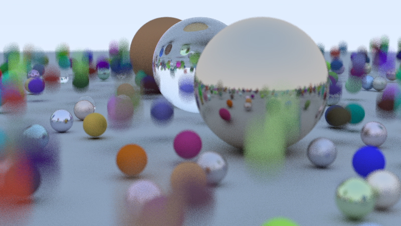
Key:
1. BVH Node是在构造函数时候就递归划分了，所以是在递归构造函数
2. hit超级简单，但是由于hit中访问BVH的left, right,left和right是递归构造的的BVH子Node,如下：
```c
else{
        std::sort(objects.begin() + start, objects.begin() + end, func);
        auto mid =  start + object_span/2;
        left = std::make_shared<BVH>(objects, start, mid, time0, time1);
        right = std::make_shared<BVH>(objects, mid, end, time0, time1);
    }
```
3. 不过我觉得有一定的bug，他的bvh sort函数，有问题: bbox访问的是time=[0,0]
```c
inline bool box_compare(const shared_ptr<hittable> a, const shared_ptr<hittable> b, int axis) {
    aabb box_a;
    aabb box_b;
    if (!a->bounding_box(0,0, box_a) || !b->bounding_box(0,0, box_b))
        std::cerr << "No bounding box in bvh_node constructor.\n";
    return box_a.min().e[axis] < box_b.min().e[axis];
}
bool box_x_compare (const shared_ptr<hittable> a, const shared_ptr<hittable> b) { return box_compare(a, b, 0); }
bool box_y_compare (const shared_ptr<hittable> a, const shared_ptr<hittable> b) { return box_compare(a, b, 1); }
bool box_z_compare (const shared_ptr<hittable> a, const shared_ptr<hittable> b) { return box_compare(a, b, 2); }

```
4. 现代C++提供了更加好的解决方案，代码量减少:
```c++
BVH::BVH(std::vector<HittablePtr> &objects, size_t start, size_t end, double time0, double time1) {
    int axis = random_int(0,2);
    auto func = [axis, time0, time1](const HittablePtr &a, const HittablePtr &b){
        auto a_bbox = a->bbox(time0, time1);
        auto b_bbox = b->bbox(time0, time1);
        return a_bbox.min()[axis] < b_bbox.min()[axis];
    };
    
    size_t object_span = end - start;
    if(object_span == 1){
        left = right = objects[start];
    }
    else if(object_span == 2){
        if (func(objects[start], objects[start+1])) {
            left = objects[start];
            right = objects[start+1];
        } else {
            left = objects[start+1];
            right = objects[start];
        }
    }
    else{
        std::sort(objects.begin() + start, objects.begin() + end, func);
        auto mid =  start + object_span/2;
        left = std::make_shared<BVH>(objects, start, mid, time0, time1);
        right = std::make_shared<BVH>(objects, mid, end, time0, time1);
    }
    AABB box_left = left->bbox(time0, time1);
    AABB box_right = right->bbox(time0, time1);
    box = surroundingBox(box_left, box_right);
}
```
5. performance：

* BVH : 83s
* Brute force : 450s

## CP_03 Texture : a checker ground

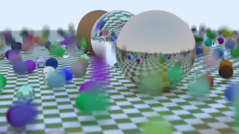


## CP_04 PerlinBlock
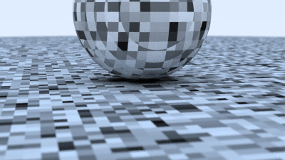

More elegant implementation PerlinBlock of C++ 20 

```C++
#include <vector>
#include <ranges>
#include "Core/Utils.hpp"
class Perlin {
public:
    static inline constexpr int pointCount = 256;
    Perlin(){
        randFloat.resize(pointCount);
        std::ranges::generate(randFloat, [](){return random_double();});

        permX.resize(pointCount);
        permY.resize(pointCount);
        permZ.resize(pointCount);

        auto iter = std::views::iota(0, pointCount);
        permX.assign(std::begin(iter), std::end(iter));
        permY.assign(std::begin(iter), std::end(iter));
        permZ.assign(std::begin(iter), std::end(iter));

        std::ranges::shuffle(permX, RandEngine::instance().generator);
        std::ranges::shuffle(permY, RandEngine::instance().generator);
        std::ranges::shuffle(permZ, RandEngine::instance().generator);
    }
    template<typename T>
    inline double noise(const T& P) const {
        auto i = static_cast<int>(4*P.x()) & 255;
        auto j = static_cast<int>(4*P.y()) & 255;
        auto k = static_cast<int>(4*P.z()) & 255;
        return randFloat[perm_x[i] ^ perm_y[j] ^ perm_z[k]];
    }
private:
    std::vector<double> randFloat;
    std::vector<int> permX;
    std::vector<int> permY;
    std::vector<int> permZ;
};


```
Compared to the previous:

```c
#ifndef PERLIN_H
#define PERLIN_H
#include "rtweekend.h"
class perlin {
    public:
        perlin() {
            ranfloat = new double[point_count];
            for (int i = 0; i < point_count; ++i) {
                ranfloat[i] = random_double();
            }
            perm_x = perlin_generate_perm();
            perm_y = perlin_generate_perm();
            perm_z = perlin_generate_perm();
        }
        ~perlin() {
            delete[] ranfloat;
            delete[] perm_x;
            delete[] perm_y;
            delete[] perm_z;
        }
        double noise(const point3& p) const {
            auto i = static_cast<int>(4*p.x()) & 255;
            auto j = static_cast<int>(4*p.y()) & 255;
            auto k = static_cast<int>(4*p.z()) & 255;
            return ranfloat[perm_x[i] ^ perm_y[j] ^ perm_z[k]];
        }
    private:
        static const int point_count = 256;
        double* ranfloat;
        int* perm_x;
        int* perm_y;
        int* perm_z;

        static int* perlin_generate_perm() {
            auto p = new int[point_count];
            for (int i = 0; i < perlin::point_count; i++)
                p[i] = i;
            permute(p, point_count);
            return p;
        }

        static void permute(int* p, int n) {
            for (int i = n-1; i > 0; i--) {
                int target = random_int(0, i);
                int tmp = p[i];
                p[i] = p[target];
                p[target] = tmp;
            }
        }
};
#endif
```

## CP_05 TextureMapping
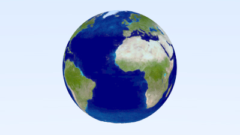

## CP_06 Constant Material
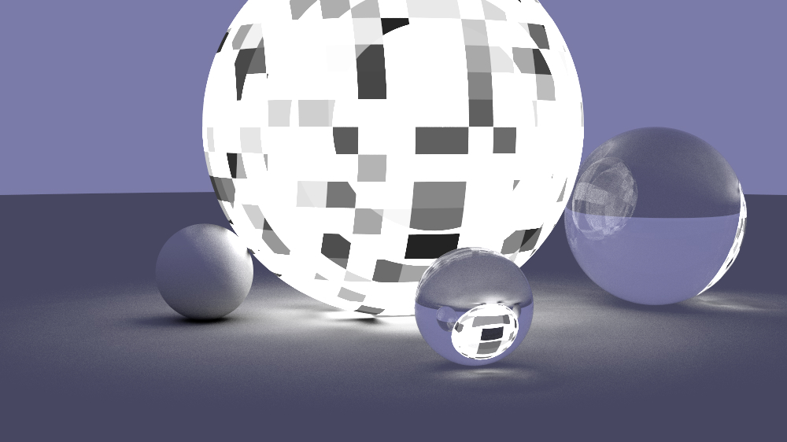

dark background :

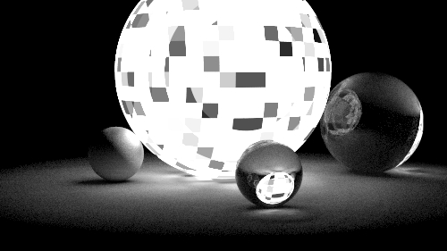


## CP_07 Constant Material Bug Fixed

Let's look at the correct results in the previous section

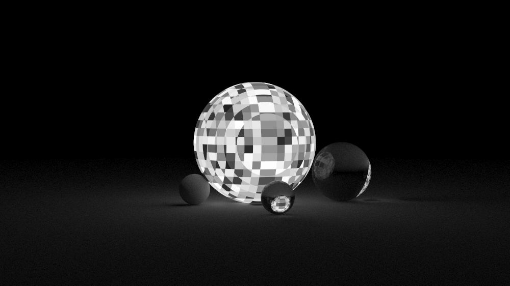


Rect hit:

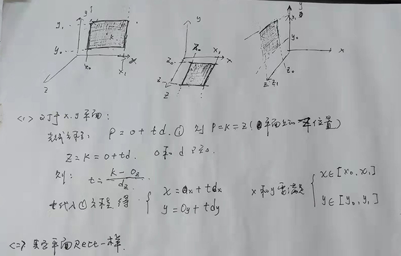


At first I saw that this result must be wrong:

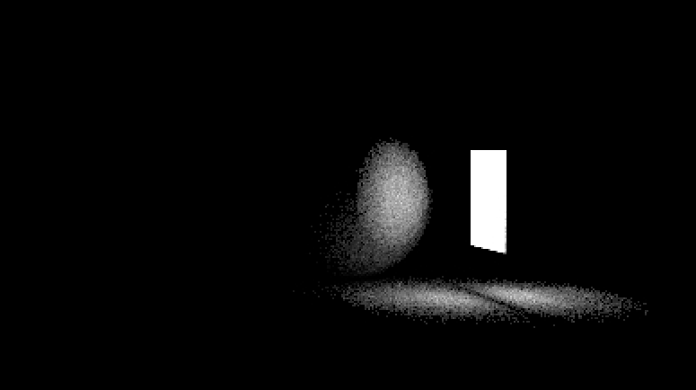

Then I went to Houdini and rendered it:

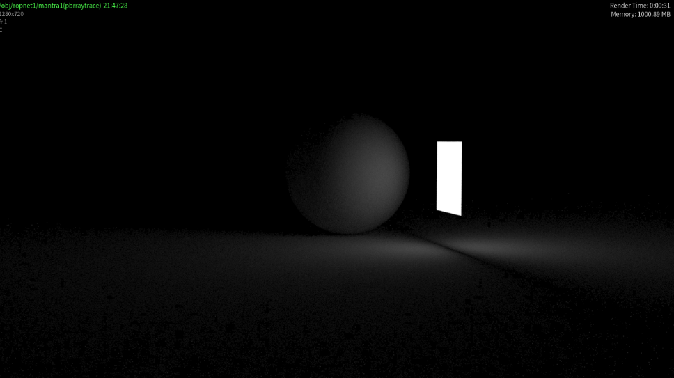


 **What went wrong!!**  
1. Lambertian reflected direction
2. Random value


So, the solution is:

1. change lambertian.hpp :
```C++
auto scatterDirection = rec.normal + HemisphereScatter<Vec3>::surface(rec.normal);
```
to:
```c++
auto scatterDirection =    HemisphereScatter<Vec3>::surface(rec.normal);
```
2. change the random value gen:
```C++
template<typename vec_t>
class SphereScatter{
public:
    // sample point inside sphere, use reject method
    static inline auto interior(){
        while (true) {
            auto x = random_double(-1,1);
            auto y = random_double(-1,1);
            auto z = random_double(-1,1);
            auto p = vec_t{x,y,z};
            if (length_squared(p)>= 1) continue;
            return p;
        }
    }
    // sample point on unit sphere surface, // -------here to change--------------
    static inline vec_t surface() {
        auto a = random_double(0, 2*pi);
        auto z = random_double(-1, 1);
        auto r = sqrt(1 - z*z);
        return vec_t(r*std::cos(a), r*std::sin(a), z);
    }
    
    // Here is the wrong code,I've tested it. For one thing, Normalize is time-consuming and sampling is uneven  
    //static inline vec_t surface() {
    //    return normalize(interior());  
    //}
    
    
};
template<typename vec_t>
class HemisphereScatter{
public:
    // sample point in unit hemisphere
    static inline auto surface(const vec_t& normal) {
        vec_t dir{};
        auto in_unit_sphere = SphereScatter<vec_t>::surface();
        if (dot(in_unit_sphere, normal) > 0.0) // In the same hemisphere as the normal
            dir = in_unit_sphere;
        else
            dir = -in_unit_sphere;
        return dir;
    }
};

```
3. change the random value generator:
```C++
template<typename T>
class Singleton
{
public:
    Singleton(Singleton const &) = delete;
    Singleton & operator = (Singleton const &)= delete;
    static T& instance(){
        static thread_local T t;      // here!!! https://stackoverflow.com/questions/21237905/how-do-i-generate-thread-safe-uniform-random-numbers
        return t;
    }
protected:
    Singleton()= default;
};
```

That makes sense:

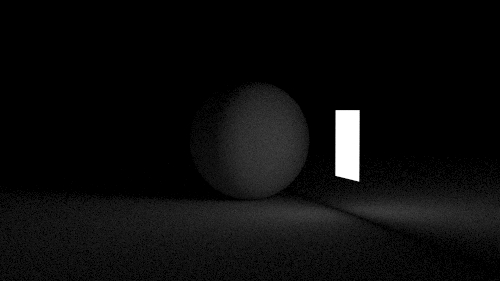


## change to GLM
I'm too lazy to write the matrix

operators of GLM are very simple:
```c
template<typename T>
concept exclude_float = std::is_arithmetic_v<T> && !std::is_same_v<T,float>;

template<typename T>
struct GLM_TypeSize;

template<>
struct GLM_TypeSize<glm::vec2>{
    static inline int value = 2;
};
template<>
struct GLM_TypeSize<glm::vec3>{
    static inline int value = 3;
};
template<>
struct GLM_TypeSize<glm::vec4>{
    static inline int value = 4;
};

template<typename  T>
concept expect_glm_vec = std::is_same_v<T, glm::vec3 > || std::is_same_v<T, glm::vec2> || std::is_same_v<T, glm::vec4>;


// vec * double
inline decltype(auto) operator * (expect_glm_vec auto vec, exclude_float auto  real ){
    using type = std::remove_cvref_t<decltype(vec)>; type ret{};
    for(int i=0;i < GLM_TypeSize<type>::value ;i++)
        ret[i] = vec[i] * real;
    return ret;
}

// real * vec, exclude float, Because GLM is already implemented
inline auto operator * (exclude_float auto  real ,expect_glm_vec auto var2){
    using type = std::remove_cvref_t<decltype(var2)>; type ret{};
    for(int i=0;i < GLM_TypeSize<type>::value ;i++)
        ret[i] = var2[i] * real;
    return ret;
}

// float / vec
inline decltype(auto) operator / (std::floating_point auto real , expect_glm_vec auto var2){
    using type = std::remove_cvref_t<decltype(var2)>; type ret{};
    for(int i=0;i < GLM_TypeSize<type>::value ;i++)
        ret[i] = real/ var2[i];
    return ret;
}

// vec / float
inline decltype(auto) operator / ( expect_glm_vec auto var, std::floating_point auto real){
    using type = std::remove_cvref_t<decltype(var)>; type ret{};
    for(int i=0;i < GLM_TypeSize<type>::value ;i++)
        ret[i] = var[i] / real;
    return ret;
}
// vec / int
inline decltype(auto) operator / ( expect_glm_vec auto var,  int real){
    return var/static_cast<float>(real);
}

inline auto length_squared(expect_glm_vec auto vec){
    return glm::dot(vec,vec);
}
```

## CP_09 Empty Cornell box
scene(scene.hip):

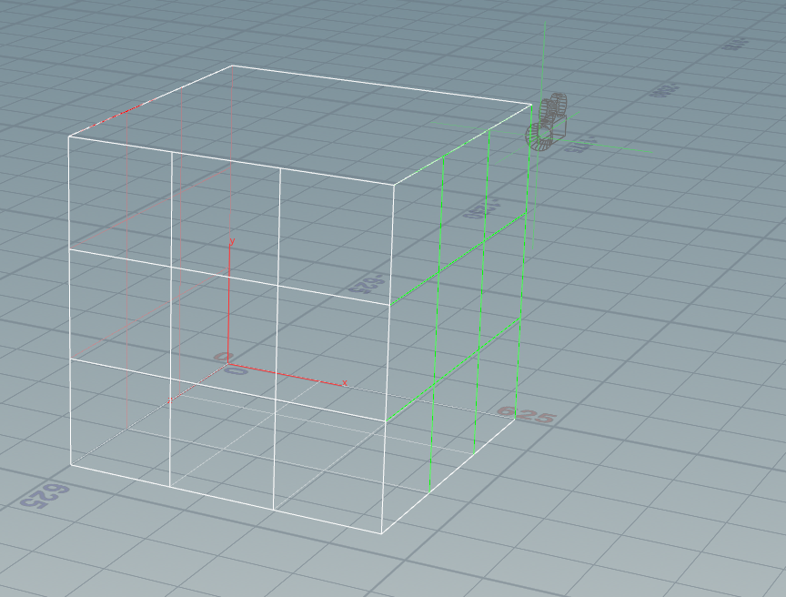


```cpp
inline auto cornell_box(){
    HittableList world;
    auto red   = std::make_shared<Lambertian>(Color(.65, .05, .05));
    auto white = std::make_shared<Lambertian>(Color(.73, .73, .73));
    auto green = std::make_shared<Lambertian>(Color(.12, .45, .15));
    auto light = std::make_shared<Constant>(Color(15, 15, 15));

    world.add(std::make_shared<YZ_Rect>(0,555,0,555,555, green)); // right
    world.add(std::make_shared<YZ_Rect>(0,555,0,555,0, red)); // left
    world.add(std::make_shared<XZ_Rect>(0, 555, 0, 555, 0, white)); // bottom
    world.add(std::make_shared<XZ_Rect>(0, 555, 0, 555, 555, white)); //top
    world.add(std::make_shared<XY_Rect>(0, 555, 0, 555, 555, white)); // front
    world.add(std::make_shared<XZ_Rect>(213, 343, 227, 332, 554, light));
    return world;
}
```


1.  lambertian of hemisphere distribution :
```cpp
auto scatterDirection =    HemisphereScatter<Vec3>::surface(rec.normal);
```

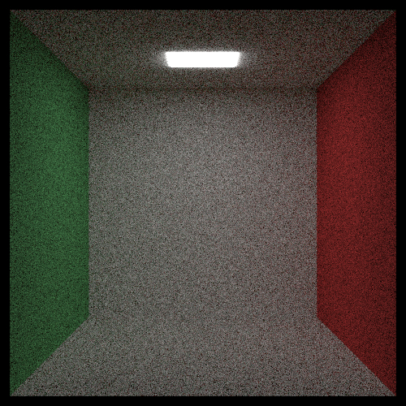


2. lambertian of sphere distribution
```cpp
auto scatterDirection =    rec.normal + SphereScatter<Vec3>::surface();
```
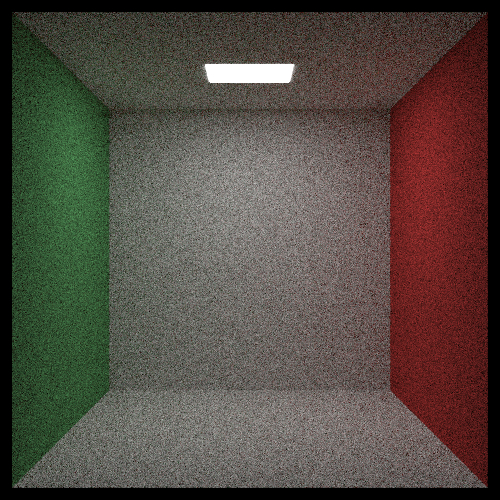

## CP_10 Cornell Box no transformation

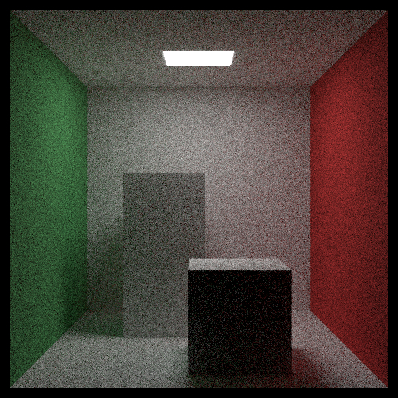


```cpp
inline auto cornell_box_no_transformation(){
    HittableList ret;
    auto red   = std::make_shared<Lambertian>(Color(.65, .05, .05));
    auto white = std::make_shared<Lambertian>(Color(.73, .73, .73));
    auto green = std::make_shared<Lambertian>(Color(.12, .45, .15));
    auto light = std::make_shared<Constant>(Color(15, 15, 15));

    ret.add(std::make_shared<YZ_Rect>(0,555,0,555,555, green)); // right
    ret.add(std::make_shared<YZ_Rect>(0,555,0,555,0, red)); // left
    ret.add(std::make_shared<XZ_Rect>(0, 555, 0, 555, 0, white)); // bottom
    ret.add(std::make_shared<XZ_Rect>(0, 555, 0, 555, 555, white)); //top
    ret.add(std::make_shared<XY_Rect>(0, 555, 0, 555, 555, white)); // front
    ret.add(std::make_shared<XZ_Rect>(213, 343, 227, 332, 554, light));
    ret.add(std::make_shared<Box>(Vec3{130, 0, 65}, Vec3{295, 165, 230}, white));
    ret.add(std::make_shared<Box>(Vec3{265, 0, 295}, Vec3{430, 330, 460}, white));
    return ret;
}
```


## CP_11 TransformHittable of instance
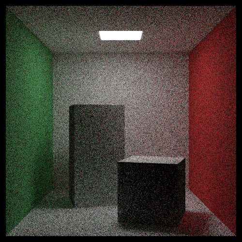

> 正常思路Raytrace:
1. 首先对一个物体进行变换，无非就是将物体的每顶点做矩阵变换，当物体的顶点非常多，那么这一步消耗比较大
2. 然后我们对其Ray intersection
> 正确套路Raytrace:
3. 不变化物体，变换光线
4. 然后对变换后的光线intersection的信息做一次矫正
5. 这个对巨量集分布到场景中，渲染提升效率非常大。
6. 这个消耗主要在相关intersection信息做的矫正，比如法线修正，p修正
> 转换到矩阵运算：
7. 理解教材中的，实际上教材是直接把矩阵运算直接写出来了，这种做法就是消耗非常小，
如果用矩阵的话，比如沿着Y旋转，Y完全没有必要做矩阵运算,我的代码全部转换为矩阵操作，主要是代码简洁
GLM全是在齐次坐标下完成。所以都是44矩阵。
```cpp
class Hittable_Rotate_Y: public Hittable{
public:
    Hittable_Rotate_Y(const HittablePtr &geo, float angle ): ptr{geo}, rad{ glm::radians(angle)}{
        auto box = ptr->bbox(0,1);
        auto boxMin = box.min();
        auto boxMax = box.max();
        rotMatrix = glm::rotate(rotMatrix, rad, Vec3{0,1,0});
        Vec3 rotBoxMin = rotMatrix *  glm::vec4{rotBoxMin, 1.0f};
        Vec3 rotBoxMax = rotMatrix *  glm::vec4{rotBoxMax, 1.0f};
        auto newBoxMin = glm::min(boxMin, rotBoxMin);
        auto newBoxMax = glm::min(boxMax, rotBoxMax);
        calBox = AABB{newBoxMin, newBoxMax};
    }
    bool hit(const Ray &ray, double t_min, double t_max, HitRecord &rec) const override {
        // reverse rotate ray
        auto origin = ray.origin();
        auto dir = ray.direction();
        
        auto inverseRotMatrix = glm::inverse(rotMatrix);
        origin = inverseRotMatrix * glm::vec4{origin, 1.0f};
        dir = inverseRotMatrix * glm::vec4{dir, 1.0f};
        Ray rotated_r{origin, dir, ray.time()};
        
        if(!ptr->hit(rotated_r, t_min, t_max, rec))
            return false;
        auto p = rec.p;
        auto normal = rec.normal;
        rec.p = rotMatrix * glm::vec4{p,1.0f};
        rec.normal = rotMatrix * glm::vec4{normal,1.0f};
        rec.set_face_normal(rotated_r, normal);
        return true;
    }

    AABB bbox(double time0, double time1) const override {
        return calBox;
    }

    HittablePtr ptr;
    float rad{0};
    AABB calBox;
    glm::mat4 rotMatrix{1.0f};
};
```

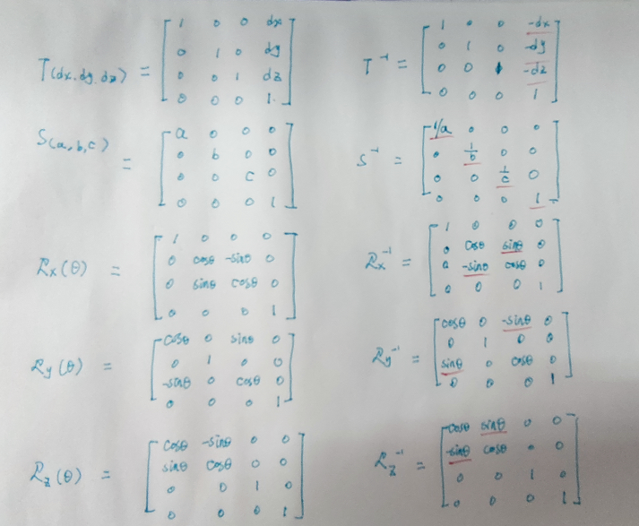

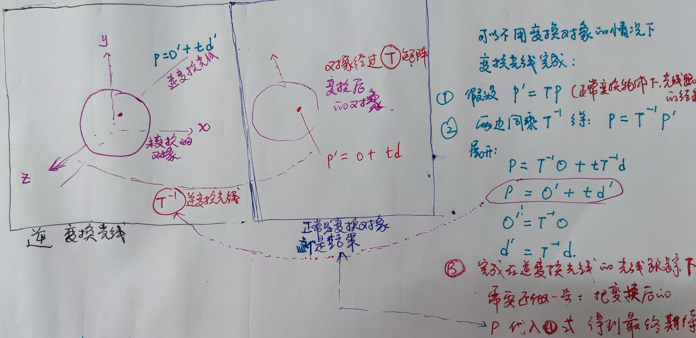

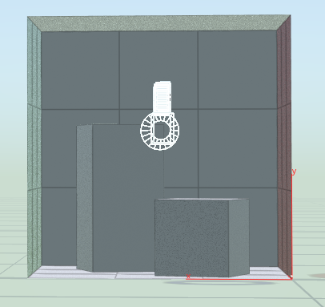


