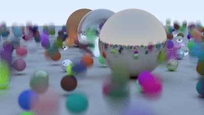

## C++ 20 Generic Method : Raytracing the next week
* follow the author
* may be with some extensions 

## CP_01 motion blur:

key: 
1. 关键点就是模拟一个camera shutter_open shutter_close
2. 提供一个Ray class 提供一个RayTime 
3. camera get ray方法， 会生成一个RayTime = [shutter_open, shutter_close] 
4. 所有的Geometry遵循RayTime Position（也就是至少2 frame geometry 位置描述)，current is linear position motion blur，not deformation blur 

